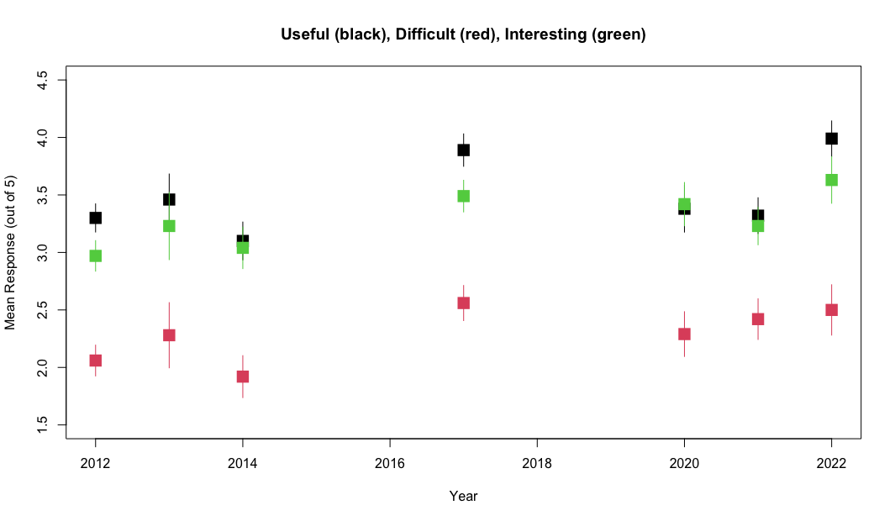
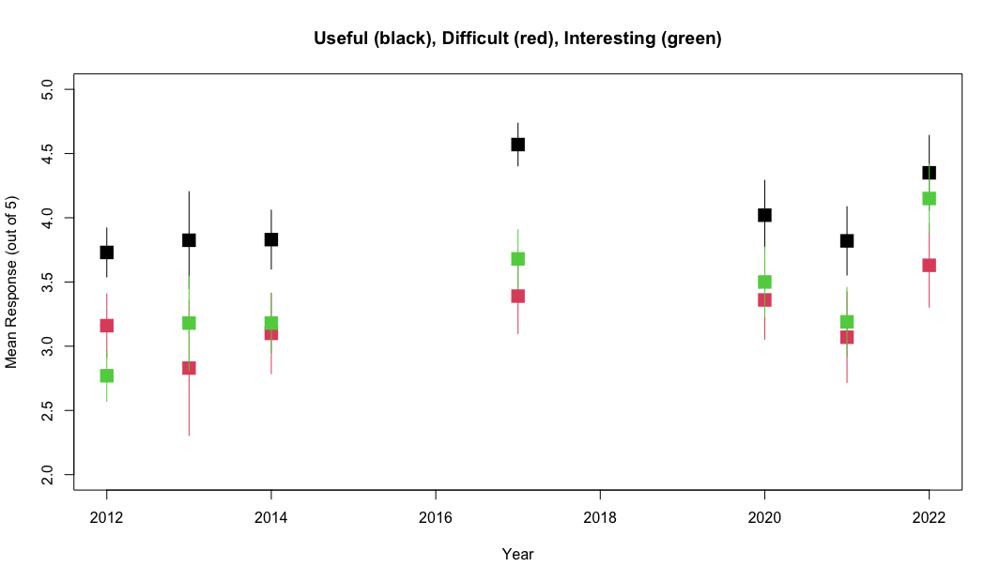

Week 14 Lab
=============

In lab we'll go through 

1. Some practice with PCA using the semester survey results

2. Some practice with GLMs using the semester survey results

There are a number of functions you could use in R to do principal components analysis. We will use the 'prcomp' function, but there is a very closely related function called 'princomp' as well as a function called 'principal' which is in the 'psych' package.


```{r}
readings<-read.csv("~/Dropbox/Biometry/Week 14 Multivariate analyses and Review/Week 14 Lab/Readings 2022.csv",header=T)

missing<-is.na(readings$Useful)|is.na(readings$Difficult)|is.na(readings$Interesting)
Useful<-aggregate(readings$Useful[!missing], by=list(Index=readings$Index[!missing]),FUN=mean)$x

Difficult<-aggregate(readings$Difficult[!missing], by=list(Index=readings$Index[!missing]),FUN=mean)$x

Interesting<-aggregate(readings$Interesting[!missing], by=list(Index=readings$Index[!missing]),FUN=mean)$x

#Length.means.readings<-aggregate(readings$Length[!missing], by=list(Index=readings$Index[!missing]),FUN=mean)$x

pca.result<-prcomp(~Useful+Interesting+Difficult,retx=T)
```

Before printing out the result, let's make sure everyone understands what I was doing with the aggregate commands, and how the 'prcomp' function input works. 

To print out a summary of the PCA, we use

```{r}
summary(pca.result)
```

We see that PCA1 is associated with over 57% of the variation in responses. So, what is PCA1?

```{r}
pca.result$rotation
```

PCA1 is an axis which describes papers that are more Interesting and less Difficult, with a very small weight towards papers that are Useful. In other words, a large positive PCA1 score would be associated with an interesting paper that was easy to read. Note that the principal components denote an axis, but the direction is arbitrary. Since no direction is implied by the sign, we do not interpret this as saying that most papers were interesting and easy. Instead we would say that the papers largely fall along a common axis in which Interesting/Easy to read papers are at one end, and Boring/Difficult to read papers are at the other end. (For now I am ignoring the small influence of Useful on PCA1.)

We can visualize this using the function 'biplot'

```{r}
biplot(pca.result)
```

Biplots take some getting used to, and when they have many more dimensions, they become increasingly difficult to interpret. However, papers high on PC1 are generally Interesting and Easy to read and papers low on PC1 are generally Boring and more Difficult to read. Papers high on PC2 are generally more Interesting and Difficult and Useful and papers low on PC2 are generally less Interesting but Easy to read and less Useful.

Which papers were highly positive on PC2? These are papers that were both Useful and Interesting.

```{r}
readings[readings$Index==15,1][1]
readings[readings$Index==25,1][1]
```

I totally agree on the Siddhartha paper!

You can play around with this yourself and see why I added the [1] at the end. When I pull out the rows with the Index identified by the PCA, I get the list of all entries (since we had >1 team rating the papers) and so I only print the first one.

Which paper fell out along the Difficult axis?

```{r}
readings[readings$Index==18,1][1]
```

Indeed, Hurlbert has a lot of information. Also, 

```{r}
readings[readings$Index==2,1][1]
```

Alas, poor Bolker! Bolker is often rated as difficult. I keep this chapter around because his thinking is so "spot on" and the material in his book will serve you well if you continue on doing quantitative modelling.

These papers are the only stand outs this year. The other readings cluster together.

One thing to keep in mind is that a PCA identifies *variation* in the dataset. It's worth putting these numbers in context of the overall means.

```{r}
mean(Useful)
mean(Difficult)
mean(Interesting)
```

So the average reading scored pretty high for being Useful and Interesting and was rated of medium Difficulty.

You might be interested in how these ratings have changed over time (I was!):

```{r echo=FALSE, fig.align='center', fig.cap='Readings ratings through the years', out.width='100%'}

```

We can do the same for the problem sets:

```{r}
PS<-read.csv("~/Dropbox/Biometry/Week 14 Multivariate analyses and Review/Week 14 Lab/ProblemSets 2022.csv",header=T)

missing<-is.na(PS$Useful)|is.na(PS$Difficult)|is.na(PS$Interesting)

Useful.means.PS<-aggregate(PS$Useful[!missing], by=list(Index=PS$Week[!missing]),FUN=mean)$x

Difficult.means.PS<-aggregate(PS$Difficult[!missing], by=list(Week=PS$Week[!missing]),FUN=mean)$x

Interesting.means.PS<-aggregate(PS$Interesting[!missing], by=list(Week=PS$Week[!missing]),FUN=mean)$x

pca.result<-prcomp(~Useful.means.PS+Interesting.means.PS+Difficult.means.PS,data=PS,retx=T)
```

Notice that it has simply labeled them in order, so 7=Week #9 PS, 8=Week #10 PS, 9=Week #11 PS, 10=Week #12 PS, and 11=Week #13 PS.

To print out a summary of the PCA, we use

```{r}
summary(pca.result)
```

We see that for the problem sets, PC1 is even more dominant (85% of the variation). So, what is PCA1?

```{r}
pca.result$rotation
```

PC1 almost evenly combines all three factors, and the axis divides problem sets judged Useless/Boring/Difficult and those that are Useful/Interesting/Easy. (Reminder: the signs of the PCs is arbitrary, so the signs on the rotation could have all be flipped.) Looking across all the PC axes, we want papers that are low (negative) on PC1 and low (negative) on PC2. PC3 is a toss up, because that axis represents a trade-off between Useful and Interesting.

```{r}
biplot(pca.result)
```

We can see that problem set 6 is the one that is really driving variation here! If we were to eliminate week 6, the others are all varying primarily on PC2.

Again, looking at the means:

```{r}
mean(Useful.means.PS)
mean(Difficult.means.PS)
mean(Interesting.means.PS)
```

The problem sets overall rated as being very Useful and Interesting but also sort of Difficult. 

The changes through time show a significant trend (not shown) in Interesting, but generally problem sets are becoming more interesting over time and are becoming slightly more Useful but also a hair more Difficult as well.

```{r echo=FALSE, fig.align='center', fig.cap='Problem set ratings through the years', out.width='100%'}

```


Missing at random - practice with GLMs
--------------------------------------

This year, we had no missing data! Usually, there are missing data for some of the readings, so for the purposes of the rest of the lab, I will use last year's data. 

```{r}
readings<-read.csv("~/Dropbox/Biometry/Week 14 Multivariate analyses and Review/Week 14 Lab/Readings 2021.csv",header=T)
missing<-is.na(readings$Useful)|is.na(readings$Difficult)|is.na(readings$Interesting)
Useful<-aggregate(readings$Useful[!missing], by=list(Index=readings$Index[!missing]),FUN=mean)$x

Difficult<-aggregate(readings$Difficult[!missing], by=list(Index=readings$Index[!missing]),FUN=mean)$x

Interesting<-aggregate(readings$Interesting[!missing], by=list(Index=readings$Index[!missing]),FUN=mean)$x

Length.means.readings<-aggregate(readings$Length[!missing], by=list(Index=readings$Index[!missing]),FUN=mean)$x
```

One could ask the question, are these data missing at random? In the problem set for Week #13, we completed the dataset using random imputation. In other words, we assumed that data were missing at random and we drew with replacement from the other values to replace missing datapoints. However, in this case, it seems likely that data are not missing at random. I suspect that papers were not evaluated because no one read them, and that something about the papers may predict whether the papers were read or not. We can answer this question by constructing a model for "missingness" which assumes that the probability of being evaluated is distributed as Binom(n,p) where p is the probability of being evaluated (and presumably, of having been read in the first place).

First, I need to go through the data and figure out how many times a paper was evaluated. 

```{r}
num.missing<-vector(length=max(readings$Index))
for (i in 1:max(readings$Index))
{
  num.missing.useful<-sum(as.numeric(is.na(readings$Useful[readings$Index==i])))
  num.missing.difficult<-sum(as.numeric(is.na(readings$Difficult[readings$Index==i])))
  num.missing.interesting<-sum(as.numeric(is.na(readings$Interesting[readings$Index==i])))
  max.missing<-max(num.missing.useful,num.missing.difficult,num.missing.interesting)
  num.missing[i]<-max.missing
}
```

For simplicity, I am considering "evaluated" as evaluated for all three categories (Useful, Difficult, and Interesting).

Now I use a Binomial GLM to model the probability of being evaluated as a function of Useful, Interesting, and Difficult (as rated by the other groups). Note that there were 5 groups total, so n=5.

```{r}
fit<-glm(cbind(5-num.missing,num.missing)~Useful+Difficult+Interesting,family="binomial")
summary(fit)
```

None of the covariates are significant, which isn't a surprise. Because I (accidentally) didn't pass out the Week 14 readings until Monday night, it was only the Week 14 readings that had many NAs, so we would not expect (except possibly by chance) any association with the factors of Useful, Difficult, or Interesting. 

We might suspect a high degree of multicollinearity among the predictors. We can use PCA to create new orthogonal covariates which (more efficiently) capture the variability in the survey results. 

I will rerun the PCA for the readings. (Keep in mind that we are now looking at last year's data.)

```{r}
pca.result<-prcomp(~Useful+Interesting+Difficult,retx=T)
summary(pca.result)
pca.result$rotation
```

PCA1 captures about 91% of the variability, so we try using just PCA1 in our GLM. 

```{r}
fit<-glm(cbind(5-num.missing,num.missing)~pca.result$x[,1],family="binomial")
summary(fit)
```

Still not significant.

```{r}
fit<-glm(cbind(5-num.missing,num.missing)~Length.means.readings,family="binomial")
summary(fit)
```

Length is not statistically correlated with whether a paper was rated, which is not surprising in this case because we know that the only papers not rated were the ones for the last week.
